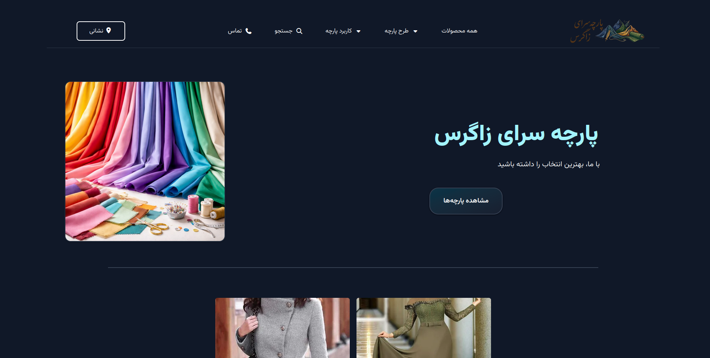
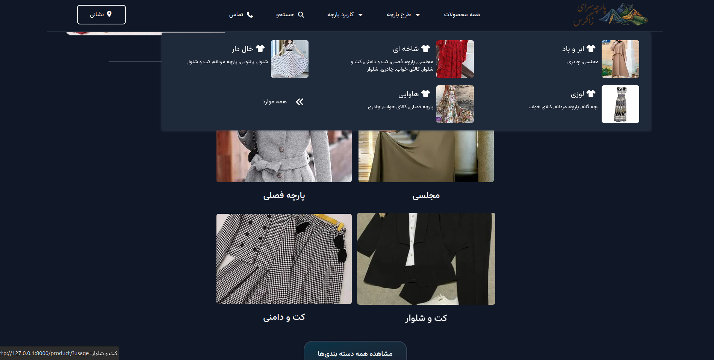
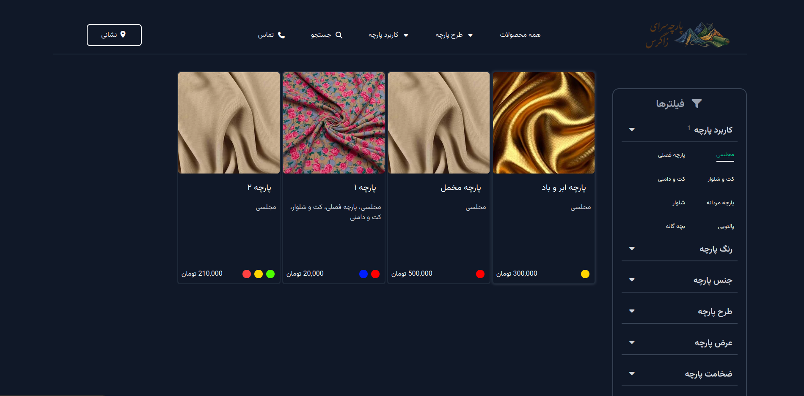
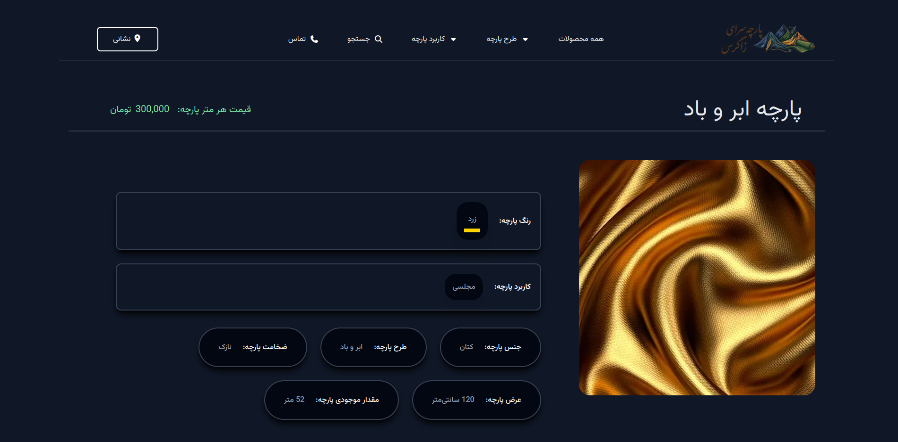
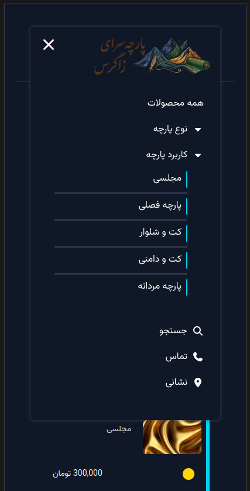

# Zagros Fabric Store — Product Showcase

A Django-based product showcase for Zagros Fabric Store.  
Displays product categories and details — no online payments.

---

## 📸 Screenshots

- Home (desktop): `screenshots/home-desktop.png`  
  

- Home + menu (desktop): `screenshots/home-with-menu-desktop.png`  
  

- Products list with filter (desktop): `screenshots/products-list-filter-desktop.png`  
  

- Product item (desktop): `screenshots/product-item-desktop.png`  
  

- Mobile menu (mobile): `screenshots/menu-mobile.png`  
  

---

## ✨ Features

- Product listing with filters (usage, color, material, pattern, width, thickness)
- Responsive header menus with accessible toggle behavior
- Price formatting and search input UX

---

## 🛠 Tech Stack

| Layer      | Technology          |
|------------|---------------------|
| Backend    | Python 3.12 / Django 6.0.2 |
| Styling    | Tailwind CSS        |
| Frontend   | Vanilla JavaScript  |
| Database   | SQLite (development)|

---

## 🚀 Getting Started

### Prerequisites

- Python 3.12

### Installation

1. Clone the repository
   git clone https://github.com/hassan-ahmadi-jo/zagros-fabric-website.git
   cd zagros-fabric-website

2. Create and activate virtual environment
   python -m venv venv
   source venv/bin/activate  # Windows: venv\Scripts\activate

3. Install dependencies
   pip install -r requirements.txt

4. Apply migrations
   python manage.py migrate

5. Run the development server
   python manage.py runserver

---

## ⚠️ Notes

- The compiled Tailwind CSS file is included in the repository — no build step required.
- Frontend JS handles menu toggles, click-outside-to-close, and price formatting.

---

## ©️ License

This project is for showcase purposes only.  
All rights reserved — no permission is granted to use, copy, or distribute this code.

---

**Author:** Hassan Ahmadi  
For questions or issues, please open a GitHub Issue.
